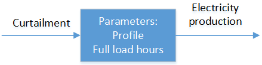
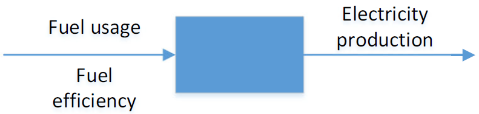
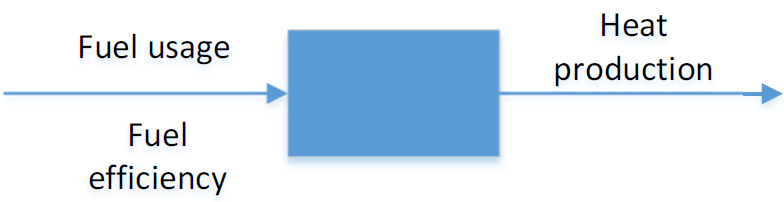
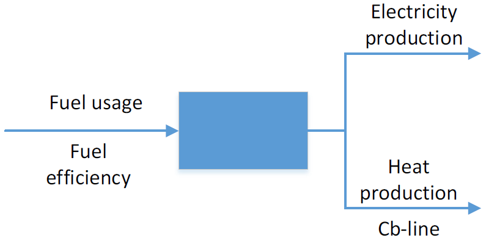
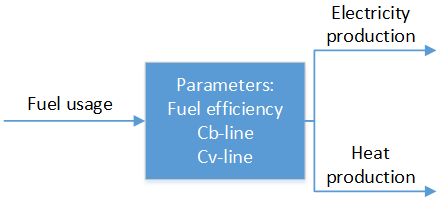
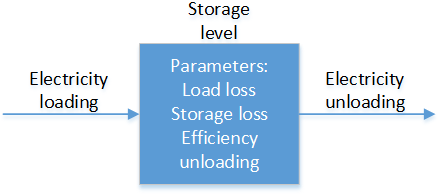
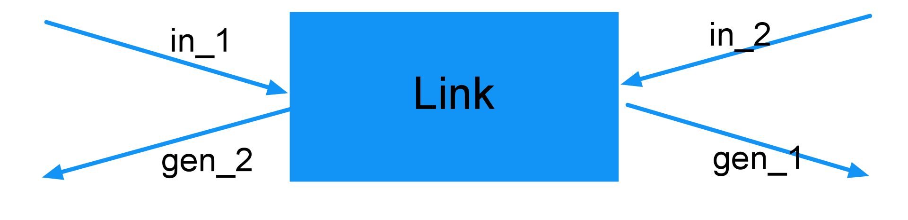
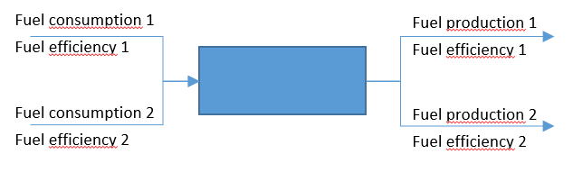

Modelling of technologies
=========================
Here the framework's representations of technologies are shown

VRE-units
*********

   Used in: Balmorel

Balmorel
''''''''
The related equation for this technology is (TO BE UPDATED):

.. math::

	{v^{gen}_{y,a,g,t}}  = (v^{inv,capa}_{y,a,g}+\kappa^{capa}_{y,a,g})\cdot \gamma^{in,gen}_{g,t} \quad \forall y \in Y, a\in A, g\in G, t\in T

Note - the full load hour is used to generate the profile (the resulting profile here called :math:`\gamma^{in,gen}_{g,t}`) so that it can be scaled according to expected future hours of sun while sticking to the same profile with respect to relative changes.

Electricity-only units
**********************

   
   Used in: Balmorel

Balmorel
''''''''

The related equation for this technology is:

.. math::

	{v^{fuse}_{y,a,g,t}}  = \frac{v^{gen}_{y,a,g,t}}{\gamma^{in,gen}_{g}} \quad \forall y \in Y, a\in A, g\in G, t\in T

Heat-only units
***************

   Used in: Balmorel

Balmorel
''''''''

The related equation for this technology is:

.. math::

	{v^{fuse}_{y,a,g,t}}  = \frac{v^{gen,heat}_{y,a,g,t}}{\gamma^{in,gen}_{g}} \quad \forall y \in Y, a\in A, g\in G, t\in T

CHP units: backpressure
***********************

   Used in: Balmorel

Balmorel
''''''''

The related equation for this technology is:

The related equations for this technology is:

1. Fuel usage

.. math::

	& {v^{fuse}_{y,a,g,t}}  = \frac{v^{gen}_{y,a,g,t} + \gamma^{CV}_g \cdot v^{gen,heat}_{y,a,g,t}}{\gamma^{in,gen}_{g}}
	
	& \forall y \in Y, a\in A, g\in G, t\in T

2. Limited by Cb-line:

.. math::

	v^{gen}_{y,a,g,t} = v^{gen,heat}_{y,a,g,t} \cdot \gamma^{CB}_g \quad \forall y \in Y, a\in A, g\in G, t\in T

CHP units: extraction
*********************

   Used in: Balmorel

Balmorel
''''''''

The related equations for this technology is:

1. Fuel usage

.. math::

	& {v^{fuse}_{y,a,g,t}}  = \frac{v^{gen}_{y,a,g,t} + \gamma^{CV}_g \cdot v^{gen,heat}_{y,a,g,t}}{\gamma^{in,gen}_{g}}
	
	& \forall y \in Y, a\in A, g\in G, t\in T

2. Limited by Cb-line:

.. math::

	v^{gen}_{y,a,g,t} \geq v^{gen,heat}_{y,a,g,t} \cdot \gamma^{CB}_g \quad \forall y \in Y, a\in A, g\in G, t\in T

3. Limited by Cv-line:

.. math::

	v^{gen}_{y,a,g,t} \leq \kappa^{capa}_{y,a,g} + v^{capa}_{y,a,g} - v^{gen,heat}_{y,a,g,t} \cdot \gamma^{CV}_g \quad \forall y \in Y, a\in A, g\in G, t\in T

Storages
********

   Used in Balmorel

Balmorel
''''''''

The necessary equation for this technology is:

.. math::
	& v^{sto,vol}_{y,a,g,t+1} = v^{sto,vol}_{y,a,g,t}\cdot \gamma^{total,gen}_{g} + v^{sto,load}_{y,a,g,t}\cdot \gamma^{in,gen}_{g} - v^{gen}_{y,a,g,t} \cdot \gamma^{out,gen}_{g}

	& \forall y \in Y, a\in A, g\in G, t\in T
    
urbs
''''

.. math::
    &\epsilon^{\text{con}}_{y,d,r,t}=\epsilon^{\text{con}}_{y,d,r,(t-1)}\cdot (1-d_{y,d,r})^{\Delta t}+e^{\text{in}}_{y,d,r}\cdot \epsilon^{\text{in}}_{y,d,r,t}- \frac{\epsilon^{\text{out}}_{y,d,r,t}}{e^{\text{out}}_{y,d,r}}\\
    &\forall y\in Y,~d\in D,~r\in R,~t\in T_m

GENeSYS-MOD	
'''''''''''

Do I understand it correct with Balmorel that v^{sto,vol} refers to the amount of energy in a storage at a given time? Then I will use it this way here as well.

.. math::

    &v^{sto,vol}_{g,r,t,y} = v^{sto,vol}_{g,r,t-1,y} + v^{sto,load}_{g,r,t-1,y}\cdot \gamma^{in}_{g,y} - \frac{v^{sto,unload}_{g,r,t-1,y}}{\gamma^{in}_{g,y}} \quad \forall g \in G, r \in R, t \in T, y \in Y\\ 

oemof.tabular
'''''''''''''

.. math::

  & \epsilon^{con}_{y,r,g,t} =
    \epsilon^{con}_{y,r,g,t-1} \cdot (1 - \gamma^{loss,con}_{r,g})
    - \frac{\epsilon^{out}_{y,r,g,t}}{\gamma^{out}_{r,g}}
    + \epsilon^{in}_{y,r,g,t} \cdot \gamma^{in}_{y,r,g}
  \\
  & {\epsilon^{con}_{y,r,g,t_0} = \epsilon^{con}_{y,r,g,t_{\infty}}} \\
  & t_0, t_{\infty} \in T
  \\
  & \forall y \in Y, r\in R, g\in G, t\in T\setminus\{t_0\}

Generation
**********

oemof.tabular
'''''''''''''

Dispatchable
------------

.. math::

  & {0 <= v^{gen}_{y,r,g,t} <= \kappa}^{capa}_{r,g}
  \\
  & \forall y \in Y, r \in R, g \in G, t \in T

Conversion
----------

.. math::

  & {v^{fuse}_{y,r,g,t}} =
  \frac{1}{\gamma^{out,gen}_{r,g}}{v^{gen}_{y,r,g,t}}
  \\
  & \forall y \in Y, r \in R, g \in G, t \in T

Volatile
--------

.. math::

  & {v^{gen}_{y,r,g,t} = \kappa^{capa}_{r,g} \cdot \gamma^{capa}_{y,r,g,t}}
  \\
  & \forall y \in Y, r \in R, g \in G, t \in T

Consumption
***********

oemof.tabular
'''''''''''''

Load
----

.. math::

  & {E^{gen}_{y,r,g,t} = E^{capa}_{y,r,g,t}}
  \\
  & \forall y \in Y, r \in R, g \in G, t \in T

Bus
***

oemof.tabular
'''''''''''''

Bus
---

.. math::

  & {v^{in}_{y,r,g,t} = v^{gen}_{y,r,g,t}}
  \\
  & \forall y \in Y, r \in R, g \in G, t \in T

Grid
****

oemof.tabular
'''''''''''''

Link
----

.. math::

  & {v^{trans,in_i}_{y,r,g,t} =
    \frac{1}{\gamma^{trans}_{r,g}} \cdot v^{trans,gen_i}_{y,r,g,t}}
  \\
  & \forall y \in Y, r \in R, g \in G, t \in T, i \in \{1, 2\}

Generic processes
*****************

urbs
''''

.. math::

    &\epsilon^{\text{in}}_{y,g,d,t}=r^{\text{in}}_{y,g,d}\tau_{y,g,t} \\
    &\epsilon^{\text{out}}_{y,g,d,t}=r^{\text{out}}_{y,g,d}\tau_{y,g,t} \\
    &\tau_{y,g,t}\leq \kappa_{y,g} \\
    &\forall y \in Y, ~g \in G, ~d \in D, ~t \in T_m

GENeSYS-MOD	
'''''''''''

   
This equation counts for all processes, no matter how many input or output fuels are required.   

.. math::

    &\frac{{v^{gen}_{f,g,m,r,t,y}}}{\gamma^{out_gen}_{f,g,m,r,y}} = \sum_{f\in F} v^{fuse}_{f,g,m,r,t,y} \cdot \gamma^{in_gen}_{f,g,m,r,y} \quad \forall f \in F, g \in G, m \in M, r \in R, t \in T, y \in Y\\ 

