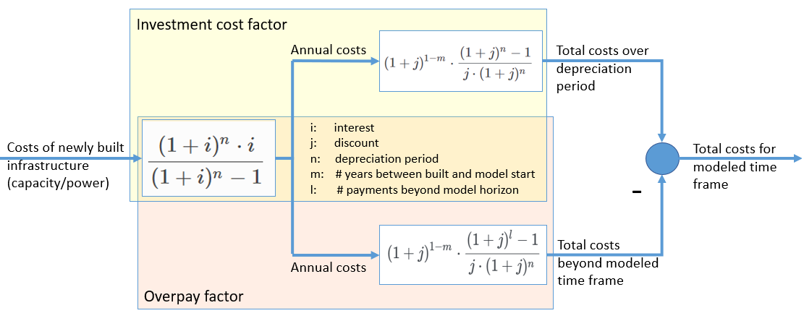
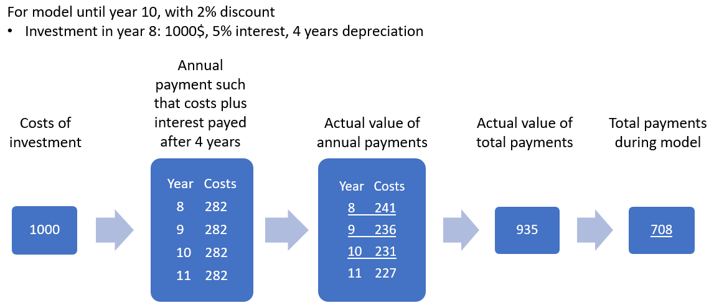

urbs
====
On this page, the most important equations like the objective function and constraints are stated.

Objective function
******************
The objective function consists of five parts:

.. math::

    \pi^\text{obj} = \pi_{\text{inv}} + \pi_{\text{fix}} + \pi_{\text{var}} + \pi_{\text{fuel}} + \pi_{\text{env}}

Investment costs

    * consists of investment costs for generation, transmission and storage
    * investment costs for trans and sto are calculated the same way as for gen,
      except sto costs are based on newly installed storage capacity **and** power

.. math::

    \pi_{\text{inv}}= \pi_{\text{inv,gen}} + \pi_{\text{inv,trans}} + \pi_{\text{inv,sto}}

    \pi_{\text{inv,gen}} = \sum_{p \in P} {\color{red}{{INVESTFAC}}_{p}} \cdot \pi^{\text{inv, capa}}_p \cdot {\color{red}{{NEWCAPACITY}}_{p}} -  \sum_{p \in P} {\color{red}{{OVRPAYFAC}}_{p}} \cdot \pi^{\text{inv, capa}}_p \cdot {\color{red}{{NEWCAPACITY}}_{p}}

Graphical representation and example of the calculation of total costs for an investment

Fixed costs for operation and maintenance

    * consists of fixed costs for generation, transmission and storage
    * fixed costs for trans and sto are calculated the same way as for gen,
      except again sto costs are based on installed storage capacity **and** power

.. math::

    \pi_{\text{fix}}= \pi_{\text{fix,gen}} + \pi_{\text{fix,trans}} + \pi_{\text{fix,sto}}

    \pi_{\text{fix,gen}}=\sum_{p \in P} {\color{red}{{COSTFAC}}_{p}} \cdot \pi^{\text{omf,capa}}_p \cdot \kappa^{\text{capa}}_p

Variable operation and maintenance costs

    * consists of fixed costs for generation, transmission and storage
    * fixed costs for trans and sto are calculated the same way as for gen,
      except trans costs are only based on transmission input and sto costs are based on energy content, inflow and outflow

.. math::

    \pi_{\text{var}}= \pi_{\text{var,gen}} + \pi_{\text{var,trans}} + \pi_{\text{var,sto}}

    \pi_{\text{var,gen}}=\sum_{t \in T_m\\ p \in P} \pi^{\text{omv,gen}}_{p} \cdot {\color{red}{Weight}} \cdot {\color{red}{{COSTFAC}}_{p}} \cdot \tau_{t,p}

Fuel costs

.. math::

    \pi_{\text{fuel}}=\sum_{t \in T_m\\ f \in F} \pi^{\text{fuel}}_{f} \cdot {\color{red}{Weight}} \cdot {\color{red}{{COSTFAC}}_{f}} \cdot v^{\text{fuse}}_{t,f}

Environment costs like costs for CO_2 emissions

.. math::

    \pi_{\text{env}}= \sum_{t \in T_m\\ e \in E} \pi^{\text{emi}}_{e} \cdot {\color{red}{Weight}} \cdot {\color{red}{{COSTFAC}}_{e}} \cdot -{\color{red}{{CB(e,t)}}}

Marked in red: things that are not in the terminology. All of these are explained in the following table:

.. list-table::
   :widths: 20 20 20 40
   :header-rows: 1

   * - Name
     - Domains
     - Type
     - Description
   * - P
     - -
     - Set
     - Tuple including all sets describing processes (year, site, process)
   * - F, E
     - -
     - Set
     - Tuples inluding all sets describing commodities (year, site, com, com type), where e is the subset of stock and f the subset of environmental commodities
   * - INVESTFAC
     - p
     - Parameter
     - Scales the investment costs taking into account the depreciation duration, interest rate and discount rate
   * - OVRPAYFAC
     - p
     - Parameter
     - Similar to INVESTFAC but calculates the investment cost payments that fall beyond the optimization period, thus should not be considered
   * - NEWCAPACITY
     - p
     - Variable
     - Amount of new capacity of a technology
   * - COSTFAC
     - p, e or f
     - Parameter
     - Includes discount factor and relative weight of a year for intertemporal model, for single year equals one
   * - Weight
     - -
     - Parameter
     - Scales the costs to a full year
   * - CB(e,t)
     - -
     - Function
     - Balance equation returning the amount of environmental commodity created

Constraints
***********

Process expansion constraints
-----------------------------
The unit expansion constraints are independent of the modeled time. In case of
the minimal model the are restricted to two constraints only limiting the
allowed capacity expansion for each process. The total capacity of a given
process is simply given by:

.. math::
   &\forall y \in Y, \forall g \in G:\\
   &\kappa_{y,g}=K_{y,g} + \widehat{\kappa}_{y,g},

where :math:`K_{y,g}` is the already installed capacity of process (generator) :math:`g` in year `y`.

Process capacity limit rule
~~~~~~~~~~~~~~~~~~~~~~~~~~~
The capacity pf each process :math:`g` is limited by a maximal and minimal
capacity, :math:`\overline{K}_g` and :math:`\underline{K}_g`, respectively,
which are both given to the model as parameters:

.. math::
   &\forall y \in Y, \forall g \in G:\\
   &\underline{K}_{y,g}\leq\kappa_{y,g}\leq\overline{K}_{y,g}.

All further constraints are time dependent and are determinants of the unit
commitment, i.e. the time series of operation of all processes and commodity
flows.

Commodity dispatch constraints
------------------------------
In this part the rules governing the commodity flow timeseries are shown.  

Vertex rule ("Kirchhoffs current law")
~~~~~~~~~~~~~~~~~~~~~~~~~~~~~~~~~~~~~~
This rule is the central rule for the commodity flows and states that all
commodity flows, (except for those of environmental commodities) have to be
balanced in each time step. As a helper function the already mentioned
commodity balance is calculated in the following way:

.. math::
   &\forall y \in Y, \forall d \in D,~t\in T_m:\\\\
   &\text{CB}(y,d,t)=
    \sum_{(d,g)\in D^{\mathrm{out}}_{g}}\epsilon^{\text{in}}_{y,d,g,t}-
    \sum_{(d,g)\in D^{\mathrm{in}}_g}\epsilon^{\text{out}}_{y,d,g,t}.

Here, the tuple sets :math:`D^{\mathrm{in,out}}_g` represent all input and
output commodities of process :math:`g`, respectively. The commodity balance
thus simply calculates how much more of commodity :math:`d` is emitted by than
added to the system via process :math:`g` in timestep :math:`t`. Using
this term the vertex rule for the various commodity types can now be written in
the following way:

.. math::
   \forall y \in Y, \forall d \in D_{\text{st}},~t \in T_m:\;
   \rho_{y,d,t} \geq \text{CB}(y,d,t),

where :math:`D_{\text{st}}` is the set of stock commodities and:

.. math::
   \forall y \in Y, \forall d \in D_{\text{dem}},~ t \in T_m:\;
   -E_{y,d,t} \geq \text{CB}(y,d,t),

where :math:`D_{\text{dem}}` is the set of demand commodities and
:math:`E_{y,d,t}` the corresponding demand for commodity :math:`d` at time
:math:`t` at year :math:`y`. These two rules thus state that all stock commodities that are
consumed at any time in any process must be taken from the stock and that all
demands have to be fulfilled at each time step.

Stock commodity limitations
~~~~~~~~~~~~~~~~~~~~~~~~~~~
There are two rule that govern the retrieval of stock commodities from stock:
The total stock and the stock per hour rule. The former limits the total amount
of stock commodity that can be retrieved annually and the latter limits the
same quantity per timestep. the two rules take the following form:

.. math::
   &\forall y \in Y, \forall d \in D_{\text{st}}:\\
   &w \sum_{t\in T_{m}}\rho_{y,d,t}\leq \Lambda_{y,d}\\\\
   &\forall d \in D_{\text{st}},~t\in T_m:\\
   &\rho_{y,d,t}\leq \lambda_{y,d},

where :math:`\Lambda_{y,d}` and :math:`\lambda_{y,d}` are the totally allowed
annual and hourly retrieval of commodity :math:`d` from the stock,
respectively, in year :math:`y`.

Environmental commodity limitations
~~~~~~~~~~~~~~~~~~~~~~~~~~~~~~~~~~~
Similar to stock commodities, environmental commodities can also be limited
per hour or per year. Both properties are assured by the following two
rules:

.. math::
   &\forall y \in Y, \forall d \in D_{\text{env}}:\\
   &-w \sum_{t\in T_{m}}\text{CB}(y,d,t)\leq \Lambda^\text{env}_{y,d}\\\\
   &\forall y \in Y, \forall d \in D_{\text{env}},~t\in T_m:\\
   & -\text{CB}(y,d,t)\leq \lambda^\text{env}_{y,d}\,

where :math:`\Lambda^\text{env}_{y,d}` and :math:`\lambda^\text{env}_{y,d}` are the totally allowed
annual and hourly emissions of environmental commodity :math:`d` to the
atmosphere, respectively, in year :math:`y`.

Process dispatch constraints
----------------------------
So far, apart from the commodity balance function, the interaction between
processes and commodities have not been discussed. It is perhaps in order to
start with the general idea behind the modeling of the process operation. In
urbs all processes are mimo-processes, i.e., in general they in take in
multiple commodities as inputs and give out multiple commodities as outputs.
The respective ratios between the respective commodity flows remain normally
fixed. The operational state of the process is then captured in just one
variable, the process throughput :math:`\tau_{gt}` and is is linked to the
commodity flows via the following two rules:

.. math::
   &\forall y \in Y, \forall g\in G,~d\in D,~t \in T_m:\\
   &\epsilon^{\text{in}}_{y,g,d,t}=r^{\text{in}}_{y,g,d}\tau_{y,g,t}\\
   &\epsilon^{\text{out}}_{y,g,d,t}=r^{\text{out}}_{y,g,d}\tau_{y,g,t},

where :math:`r^{\text{in, out}}_{y,g,d}` are the constant factors linking the
commodity flow to the operational state. The efficiency :math:`\eta` of the
process :math:`g` for the conversion of commodity :math:`d_1` into commodity
:math:`d_2` is then simply given by:

.. math::
   \eta=\frac{r^{\text{out}}_{y,g,d_2}}{r^{\text{in}}_{y,g,d_1}}.

Basic process throughput rules
~~~~~~~~~~~~~~~~~~~~~~~~~~~~~~
The throughput :math:`\tau_{gt}` of a process is limited by its installed
capacity and the specified minimal operational state. Furthermore, the
switching speed of a process can be limited:

.. math::
   &\forall y \in Y, \forall g\in G,~t\in T_m:\\
   &\tau_{y,g,t}\leq \kappa_{y,g}\\
   &\tau_{y,g,t}\geq \underline{P}_{y,g}\kappa_{y,g}\\
   &|\tau_{y,g,t}-\tau_{y,g,(t-1)}|\leq \Delta t\overline{PG}_{y,g}\kappa_{y,g},

where :math:`\underline{P}_{y,g}` is the normalized, minimal operational state of
the process and :math:`\overline{PG}_{y,g}` the normalized, maximal gradient of the
operational state in full capacity per timestep.

Intermittent supply rule
~~~~~~~~~~~~~~~~~~~~~~~~
If the input commodity is of type 'SupIm', which means that it represents an
operational state rather than a proper material flow, the operational state of
the process is governed by this alone. This feature is typically used for
renewable energies but can be used whenever a certain operation time series of
a given process is desired

.. math::
   &\forall y \in Y, \forall g\in G,~d\in D_{\text{sup}},~t\in T_m:\\
   &\epsilon^{\text{in}}_{y,g,d,t}=\gamma^{capa}_{y,g,t}\kappa_{y,g}.

Here, :math:`\gamma^{capa}_{y,g,t}` is the time series that governs the exact operation of
process :math:`g`, leaving only its capacity :math:`\kappa_{y,g}` as a free
variable.

Part load behavior
~~~~~~~~~~~~~~~~~~
Many processes show a non-trivial part-load behavior. In particular, often a
nonlinear reaction of the efficiency on the operational state is given.
Although urbs itself is a linear program this can with some caveats be captured
in many cases. The reason for this is, that the efficiency of a process is
itself not modeled but only the ratio between input and output multipliers. It
is thus possible to use purely linear functions to get a nonlinear behavior of
the efficiency of the form:

.. math::
   \eta=\frac{a+b\tau_{y,g,t}}{c+d\tau_{y,g,t}},

where a,b,c and d are some constants. Specifically, the input and output ratios
can be set to vary linearly between their respective values at full load
:math:`r^{\text{in,out}}_{y,g,d}` and their values at the minimal allowed
operational state :math:`\underline{P}_{y,g}\kappa_{y,g}`, which are given by
:math:`\underline{r}^{\text{in,out}}_{y,g,d}`. This is achieved with the following
equations:

.. math::
   &\forall y \in Y, \forall g\in G^{\text{partload}},~d\in D,~t\in T_m:\\\\
   &\epsilon^{\text{in,out}}_{y,g,d,t}=\Delta t\cdot\left(
   \frac{\underline{r}^{\text{in,out}}_{g,d}-r^{\text{in,out}}_{y,g,d}}
   {1-\underline{P}_{y,g}}\cdot \underline{P}_g\cdot \kappa_{y,g}+
   \frac{r^{\text{in,out}}_{y,g,d}-
   \underline{P}_g\underline{r}^{\text{in,out}}_{y,g,d}}
   {1-\underline{P}_{y,g}}\cdot \tau_{y,g,t}\right).

A few restrictions have to be kept in mind when using this feature:

* :math:`\underline{P}_{y,g}` has to be set larger than 0 otherwise the feature
  will work but not have any effect.
* Environmental output commodities have to mimic the behavior of the inputs by
  which they are generated. Otherwise the emissions per unit of input would
  change together with the efficiency, which is typically not the desired
  behavior.
